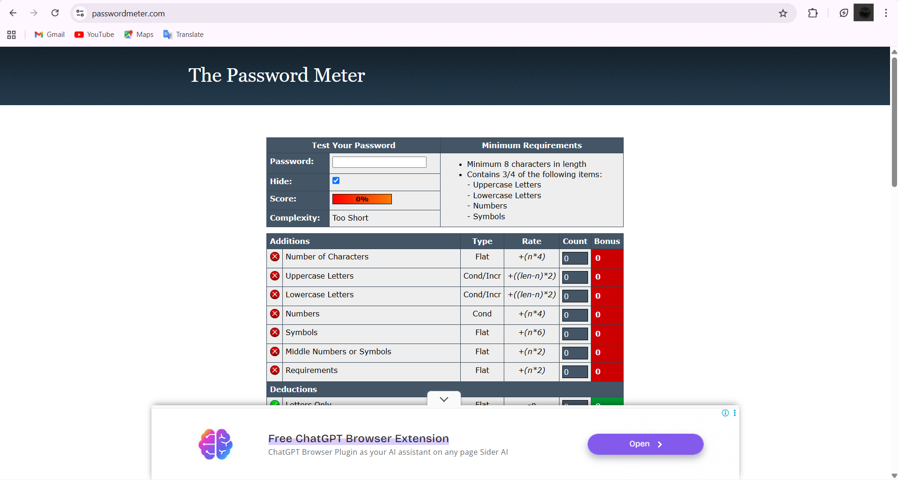
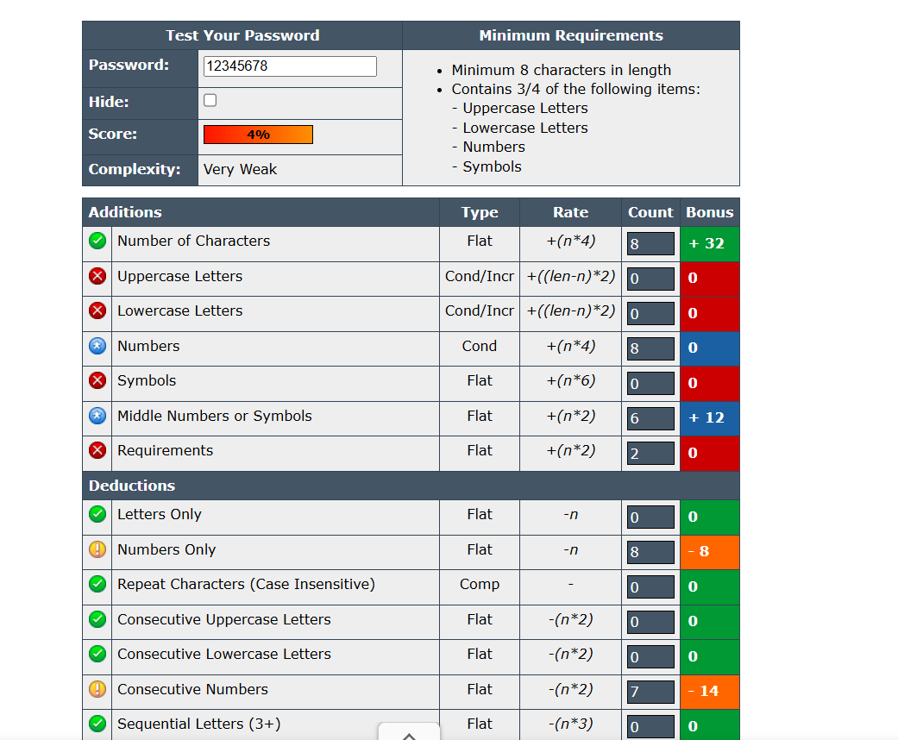
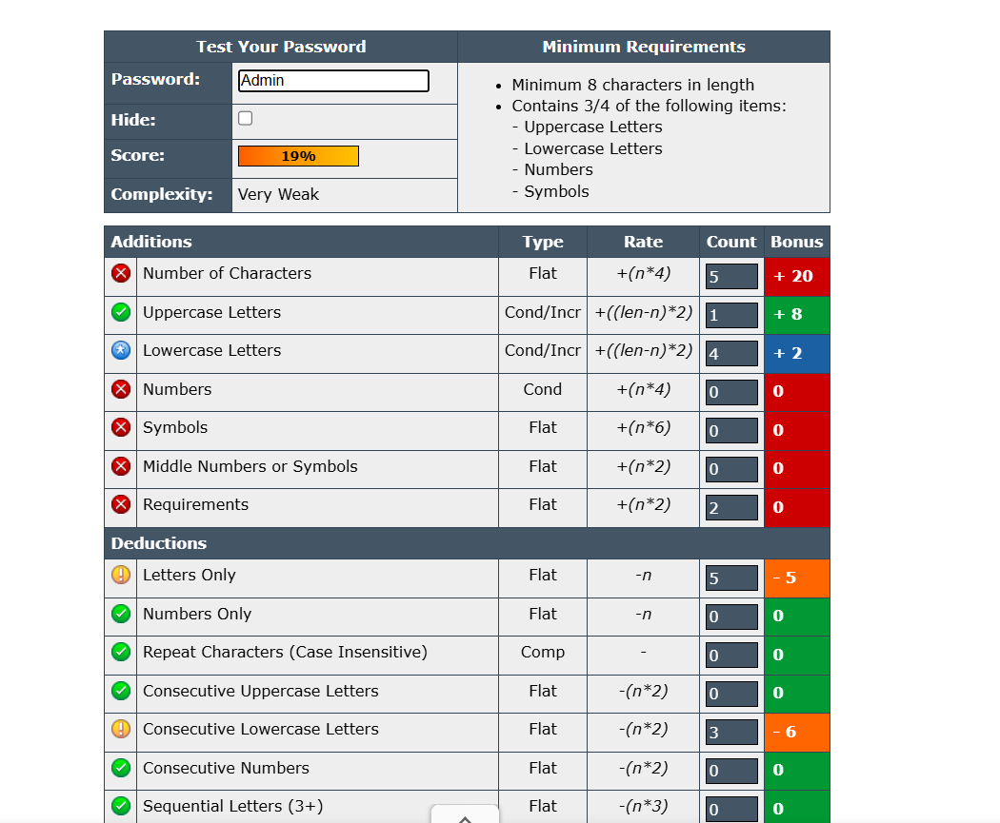
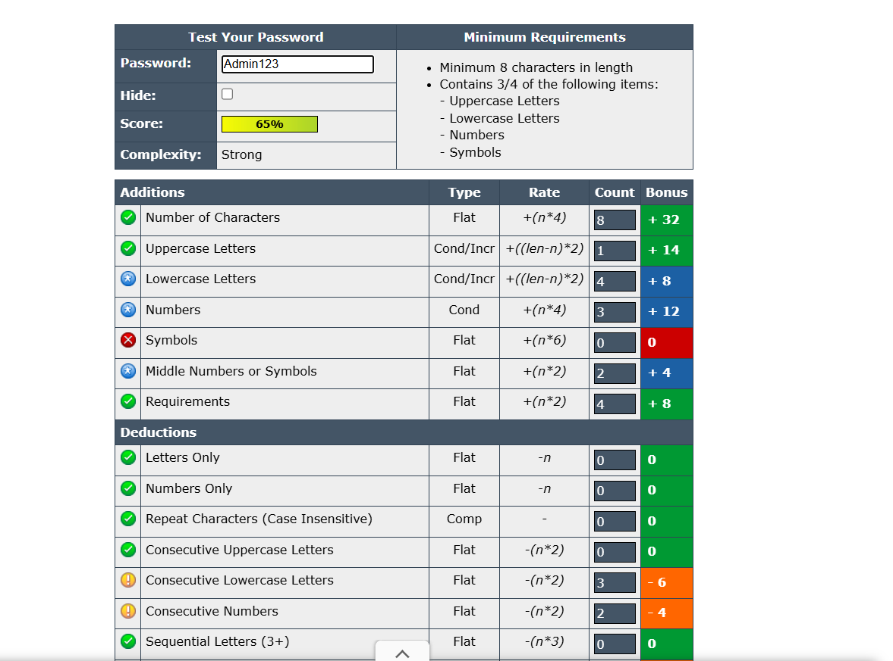
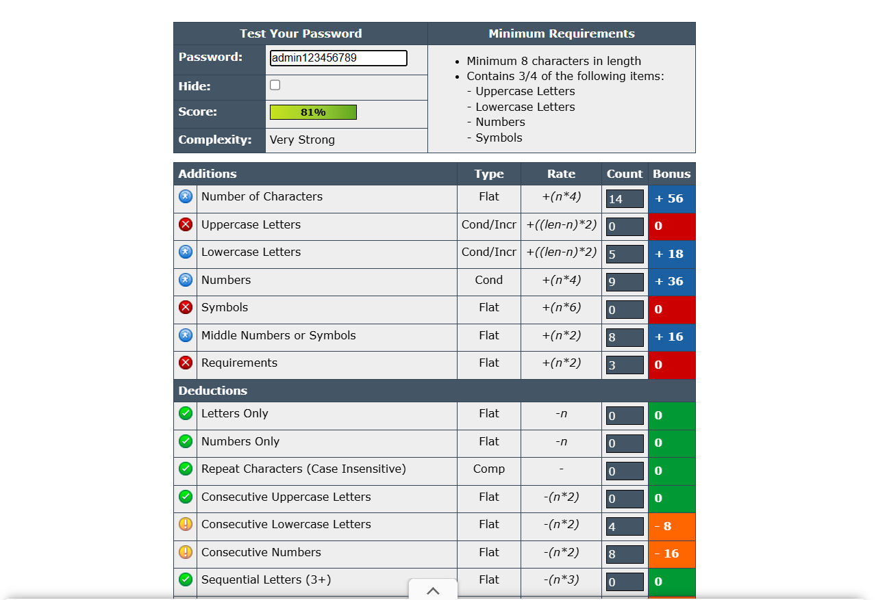
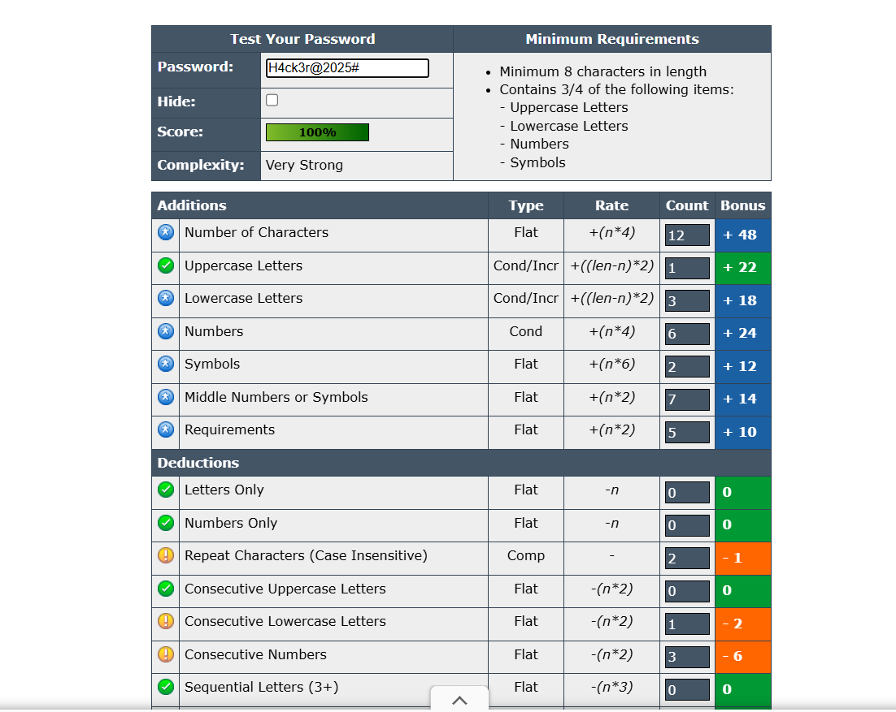

# 🔐 Task 3 – Password Strength Evaluation

## 🎯 Objective
Understand what makes a **password strong** and test different passwords using online **password strength tools**.

---

## 🧰 Tools Required
- Website: [https://passwordmeter.com](https://passwordmeter.com)

---

## 📸 Step-by-Step Procedure

### 🪟 Step 1: Browse to PasswordMeter
1. Open a web browser and go to **[passwordmeter.com](https://passwordmeter.com)**.
2. The tool provides an input box where you can type passwords and see a real-time strength score.

[]

---

### 🔢 Step 2: Test Multiple Password Variations
Create and test multiple passwords with different levels of complexity.

| Password Example | Description | Screenshot |
|------------------|-------------|-------------|
| `password` | Simple lowercase only | []
| `Password123` | Includes uppercase and numbers | []
| `P@ssw0rd!` | Mix of upper/lowercase, numbers, and symbols | []
| `My$ecureP@ssw0rd2025!` | Long, complex, strong password | []

For each test, note:
- **Score percentage**
- **Feedback** (e.g., "Add more symbols" or "Increase length")

---

### 📊 Step 3: Analyze the Results
Compare the scores and comments from the password meter.

[]

#### Observations:
- Short and simple passwords (like `password`) scored **very low** (0–10%).  
- Adding uppercase and numbers improved score moderately.  
- Including symbols and increasing length gave **highest scores (90–100%)**.  

---

## ⚙️ How Password Strength Checkers Work
Password checkers like **PasswordMeter** use algorithms that analyze:
- **Length** (longer = stronger)  
- **Character diversity** (uppercase, lowercase, digits, symbols)  
- **Predictability** (detects common patterns like “1234” or “qwerty”)  
- **Entropy** (measures randomness of characters)  

They calculate a **strength score** (usually 0–100%) and give feedback on how to improve the password.

---

## 🧠 Best Practices for Creating Strong Passwords
1. Use **at least 12–16 characters**.  
2. Mix **uppercase**, **lowercase**, **numbers**, and **symbols**.  
3. Avoid dictionary words or personal info (e.g., names, birthdays).  
4. Use **passphrases** (e.g., “C@tRunsFast!2025”) instead of single words.  
5. Change passwords periodically or when you suspect compromise.  
6. Never reuse the same password on multiple accounts.

---

## 💡 Tips Learned from Evaluation
- Adding **symbols and length** has the biggest impact on strength.  
- Passwords that appear random but are memorable (passphrases) are ideal.  
- Even strong passwords can be compromised if reused or stored insecurely.  
- Using a **password manager** helps maintain complex, unique passwords safely.

---

## 🧨 Common Password Attack Methods
| Attack Type | Description | Example / Impact |
|--------------|--------------|------------------|
| **Brute Force Attack** | Systematically tries every combination of characters until it finds a match. | Time-consuming but succeeds if password is short or simple. |
| **Dictionary Attack** | Uses a list of common words or leaked passwords to guess quickly. | Cracks weak passwords like “password123” or “welcome”. |
| **Phishing / Social Engineering** | Tricks user into revealing password directly. | Example: Fake login pages. |
| **Credential Stuffing** | Reuses stolen passwords across multiple sites. | Affects reused credentials. |

---

## 🔒 How Password Complexity Affects Security
- Every additional character **exponentially increases** the number of possible combinations.  
- Adding **symbols and case variations** drastically increases resistance to brute force attacks.  
- Complex passwords take **years or centuries** to crack using current computing power, while simple ones can fall in **seconds or minutes**.  

